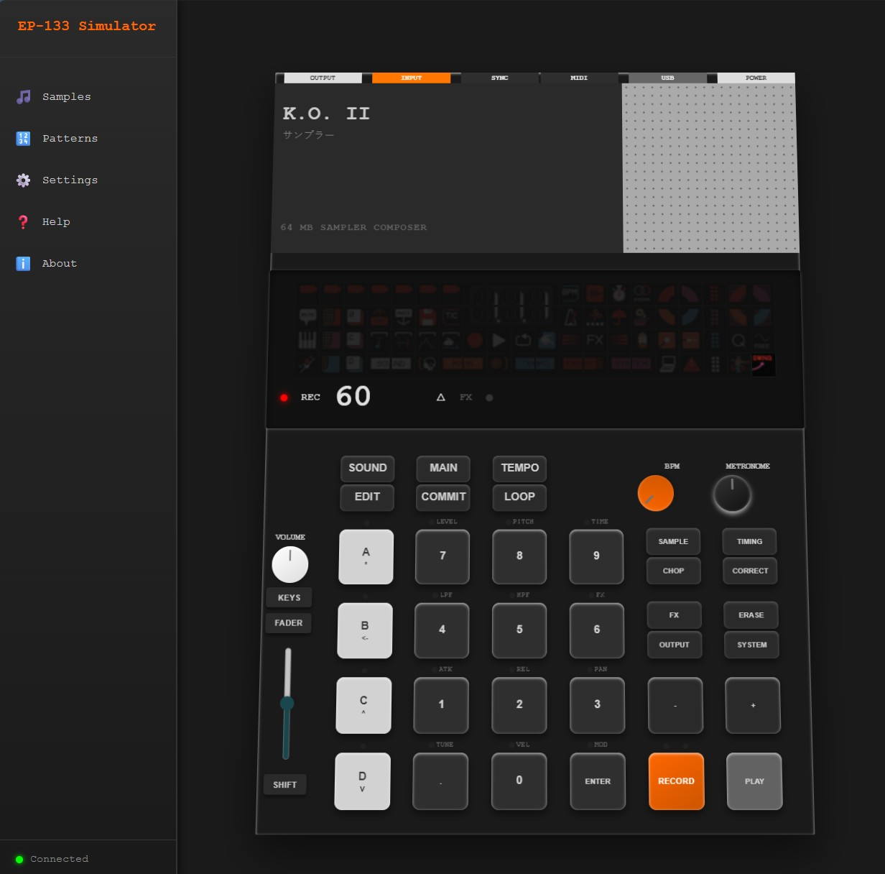
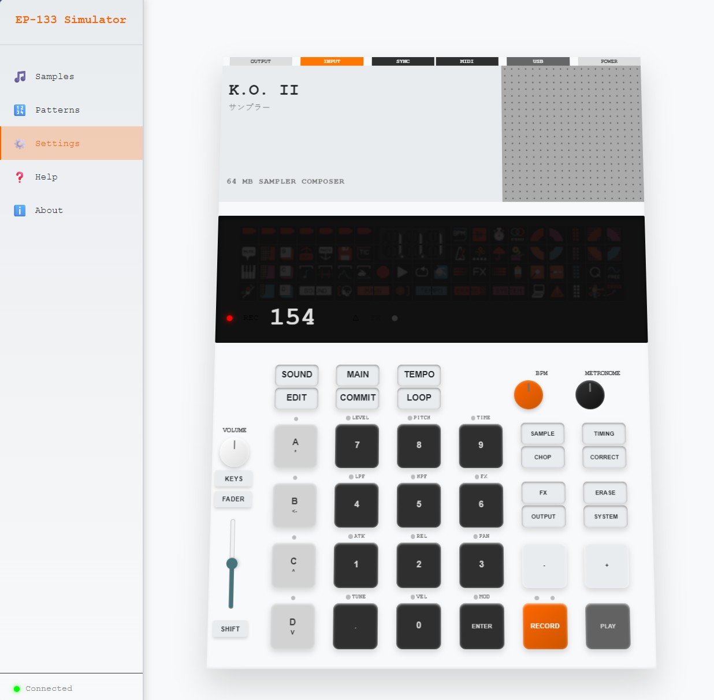

# EP-133 K.O. II Simulator

A browser-based simulator inspired by the Teenage Engineering EP-133 K.O. II interface.

## Screen Shots




## Current Status

This project currently provides:

- A detailed visual device UI with dark/light themes
- Power on/off behavior that disables the device controls when off
- Interactive pads and half-pads with mouse/touch support
- Keyboard shortcuts for `1-9`, `0`, `Space` (play), and `R` (record)
- Basic Web Audio oscillator playback for numeric pads
- A simple 16-step timing loop scaffold (sequencer core is not fully implemented yet)
- Settings persistence via `localStorage` (theme, volume, tempo, transform, tooltips, button sounds)

## What Is Not Implemented Yet

- Real sample loading/playback
- Full EP-133 pad-mode behavior
- Pattern recording/editing workflow
- Rich sequencer step triggering logic
- Export/import for patterns or samples

## Tech Stack

- HTML5
- CSS3
- Vanilla JavaScript
- Web Audio API

## Project Structure

```text
EP-133 Simulator/
|-- index.html
|-- style.css
|-- status-ids.js
|-- js/
|   |-- config.js
|   |-- audio-engine.js
|   |-- sequencer.js
|   |-- ui-manager.js
|   `-- main.js
|-- .github/
|   `-- workflows/
|       `-- html-validate.yml
`-- README.md
```

## Module Overview

- `js/config.js`: centralized configuration for audio, sequencer ranges, selectors, and storage keys
- `js/audio-engine.js`: Web Audio context lifecycle and oscillator-based pad playback
- `js/sequencer.js`: playback/record toggles, BPM management, and step loop
- `js/ui-manager.js`: DOM caching, visual state updates, status animation, theme/power handling
- `js/main.js`: application controller and event wiring across all modules

## Running Locally

1. Open `index.html` in a modern browser.
2. Interact with the page to unlock browser audio.
3. Use pads, knobs, tabs, and settings dialog to test behavior.

## Development Notes

- HTML validation is configured in GitHub Actions (`.github/workflows/html-validate.yml`).
- `Previous Versions/` contains archival files and is not part of the active runtime.

## License

This project is for educational/demo purposes and is not affiliated with Teenage Engineering.
